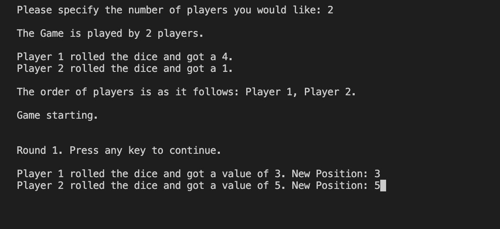

# Snakes and ladders with java

## Introduction 

The following is the code for the ladders and snakes game with Java. The main purpose is to master object oriented programming with java so it's made with the built-in console rather than a graphical user interface. 

## About the gameplay

### Number of players selection:

After running the driver the program prompts the user to select a number of players and it can take at least 2 and at most 4 players as an input. 

### Setting the players order:

The program will then roll a dice using java.random and it will select the player order relative to the repective dice roll value of each player.

### Playing the game:

The user must click any button on their keyboard to get the game going. A counter keeps track of the round number, the player position is updated and displayed after each round, and a special message is displayed when a player hits a snake or a ladder.

.png)

.png)

### Winner announcement:

The game ends when one player hits the position 100 on the grid. The winner gets announced and the program displays a goodbye message.

.png)

## About the code

It consists of three classes:
1. SnakesAndLaddersDriver is the driver which calls three methods; the welcome prompt, number of players selection, and game start.
2. Players is the class with anything related to player movement in the game; dice rolling, setting relative ID, hit/miss snakes or ladders, etc.
3. LadderAndSnake class sets the game flow and rules, and is also responsible of message prompting when necessary.

Enjoy the game :)